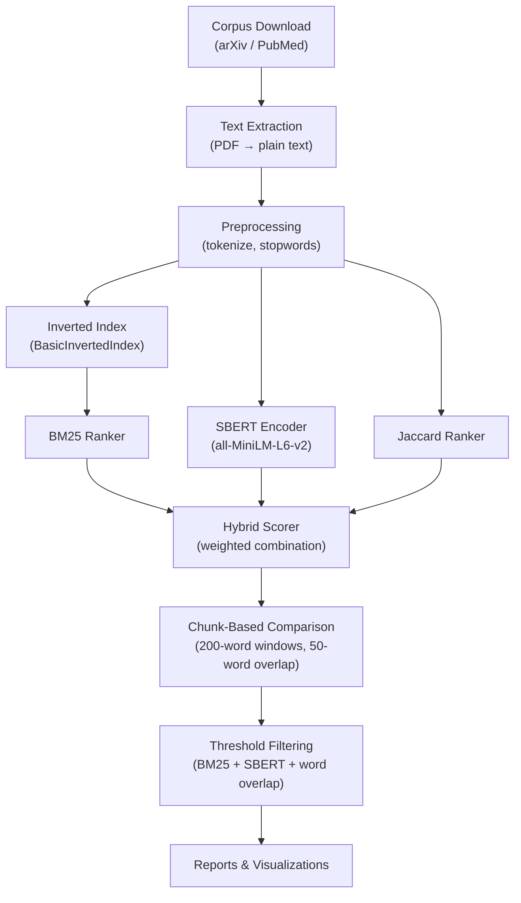

# Academic Plagiarism Detection System

An information retrieval system that detects verbatim and paraphrased text reuse between academic papers, with a focus on **in-group plagiarism** — overlap within a researcher's lab network (self, labmates, advisors, co-authors). Built for SI 650 / EECS 549 (Information Retrieval) at the University of Michigan.


---

## Overview

Standard plagiarism tools compare a manuscript against the entire web. This system instead targets **structured author networks**: given a paper, it retrieves and ranks the most semantically and lexically similar passages from the author's prior work and their collaborators' papers.

The system combines three complementary retrieval methods:
- **BM25** — fast lexical matching for direct copy-paste detection
- **SBERT** (Sentence-BERT) — semantic embeddings for paraphrase detection
- **Jaccard similarity** — word-overlap scoring for near-exact matches

All three methods can be combined into a weighted hybrid ranker for best coverage.

---

## Architecture



---

## Features

- **Multi-signal detection**: requires agreement across BM25, SBERT, and word-overlap filters to reduce false positives
- **Chunk-based analysis**: splits documents into overlapping 200-word windows for granular passage-level comparison
- **Four operation modes**: full corpus detection, single-paper query, auto-query batch, and PAN corpus evaluation
- **Corpus builders**: download scripts for both arXiv (PDF) and PubMed/PMC (XML) with automatic text extraction
- **Evaluation framework**: MAP and NDCG metrics benchmarked on the PAN Plagiarism Corpus 2011

---

## Quick Start

### 1. Install dependencies

```bash
pip install -r requirements.txt
```

```python
# First run: download NLTK data
import nltk
nltk.download('punkt')
nltk.download('stopwords')
```

### 2. Download a corpus

```bash
# Download papers for an author from arXiv
python download_corpus_arxiv.py --author "Edward Witten" --limit 20

# Or from PubMed/PMC (update Entrez.email in the script first)
python download_corpus.py --author "Kao CH" --limit 20
```

### 3. Run plagiarism detection

```bash
# Full detection across all papers in the corpus
python codetorun.py --mode detection

# Query a single paper against the corpus
python codetorun.py --mode query --query-paper path/to/paper.txt --query-name "My_Paper"

# Automatically query the N most recent papers
python codetorun.py --mode auto_query --auto-query-count 10
```

Results are saved to `results_<corpus>/` with a human-readable `.txt` report and machine-readable `.json` data.

---

## Project Structure

```
├── codetorun.py                 # Main detection system (4 modes)
├── download_corpus_arxiv.py     # arXiv corpus downloader (PDF → text)
├── download_corpus.py           # PubMed/PMC corpus downloader (XML → text)
├── eval_plagiarism.py           # Evaluation on PAN Plagiarism Corpus 2011
├── compute_pairwise_similarities.py  # Full corpus heatmap generation
├── visualize_results.py         # Results visualization
├── analyze_pan11_stats.py       # PAN corpus statistics
│
├── preprocessing.py             # Tokenization (RegexTokenizer, stopwords)
├── indexing.py                  # Inverted index with persistence
├── ranker.py                    # BM25, TF-IDF, DirichletLM, Pivoted Normalization
├── sbert_ranker.py              # Sentence-BERT semantic similarity
├── jaccard_ranker.py            # Jaccard lexical similarity
├── relevance.py                 # MAP and NDCG evaluation metrics
├── text_processing.py           # Text cleaning utilities
│
├── stopwords.txt                # English stopword list
├── Authors.txt                  # Test author list (Witten, Butte, Kao)
├── requirements.txt
└── run.sh                       # SLURM batch script for HPC cluster
```

---

## Configuration

Key parameters in `codetorun.py`'s `main()` function:

| Parameter | Default | Description |
|-----------|---------|-------------|
| `chunk_size` | 200 | Words per detection window |
| `overlap` | 50 | Overlapping words between windows |
| `similarity_threshold` | 0.5 | BM25 score threshold |
| `sbert_threshold` | 0.65 | SBERT cosine similarity threshold |
| `jaccard_threshold` | 0.4 | Jaccard similarity threshold |
| `min_word_overlap_ratio` | 0.3 | Minimum shared word fraction |
| `top_k` | 5 | Candidates retrieved per chunk |
| `use_sbert` | True | Enable semantic similarity |
| `use_jaccard` | False | Enable Jaccard similarity |
| `hybrid_mode` | False | Combine all three methods |

---

## Evaluation

The system was evaluated on the **PAN Plagiarism Corpus 2011** (external detection task) and on a real corpus of **255 arXiv papers** by physicist Edward Witten.

- Benchmarked BM25, SBERT, Jaccard, and hybrid combinations
- Metrics: MAP (Mean Average Precision) and NDCG
- Multi-signal filtering significantly reduced false positive rate compared to single-method approaches

See `eval_plagiarism.py` and `analyze_pan11_stats.py` for reproduction steps.

---

## Corpus Coverage

| Author | Source | Papers |
|--------|--------|--------|
| Edward Witten | arXiv | ~255 |
| Atul J. Butte | PubMed + arXiv | ~14 arXiv |
| Kao CH | PubMed | varies |

---

## Dependencies

| Package | Purpose |
|---------|---------|
| `sentence-transformers` | SBERT semantic embeddings |
| `nltk` | Tokenization and stopwords |
| `biopython` | PubMed/Entrez API access |
| `feedparser` | arXiv API access |
| `pdfplumber` / `PyPDF2` | PDF text extraction |
| `numpy`, `pandas` | Data processing |
| `matplotlib`, `seaborn` | Visualization |
| `tqdm` | Progress bars |

---

## Documentation

- [`IRsystem_README.md`](IRsystem_README.md) — Full system documentation with all parameters and output formats
- [`QUICKSTART.md`](QUICKSTART.md) — Minimal setup guide
- [`download_README.md`](download_README.md) — Corpus download script reference
